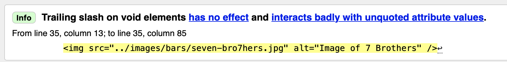
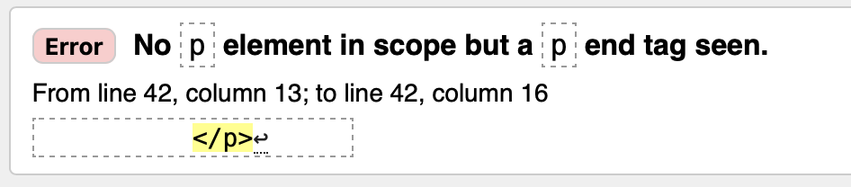
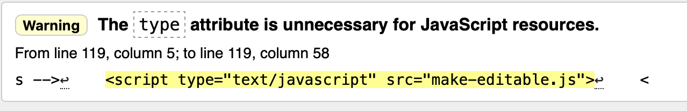

# Quality Audit

Including...

## HTML Validation

Quality and efficiency of your code. If you have implemented code that does not validate you need to explain why.

I ran each page of our site through the W3C Validation service and the same errors appeared in each.

Error 1:

All of the pictures that we had embedded into the site had this problem. We had essentially added in a trailing slash which had no useful effect on the page. I therefore went through and deleted these from every image across the site. 

Error 2:

There were a few element end tags left after copying code between pages which had no use therefore these were removed across all page.

Error 3:

This was also consistent across all pages right at the bottom. it was simply a script type tag dictating that we were using javascript which was unnecessary and was left over from the template that we built the web pages from.

## CSS Validation

Quality and efficiency.

I validated the CSS files using The W3C CSS Validation Service and all three pages were error free and displayed the result pictured above. Therefore no changes needed to be made.

## Speed test (inc. optimisation of code and media)

the download speeds are very fast with the favicon being marginally slower than the rest of the images to load. However, the download speeds are more than acceptable as the screenshot above shows,, therefore we did not find the need for further optimisation of the code or the media. 

Howvever, in the proccess of checking the speed, we discovered that certain fonts on the site werent linked properly and this was changed afterwards.

## Readability testing

When reading through the site, a few grammaticall and spelling mistakes were found which we quickly corrected for the final version.

## SEO

Review your metadata (Checkbot will help) including page titles, meta description, link text, use of headings, use of keywords in your text.

Our pages contained little meta data as shown in the image above. Therefore, we went back and added page titles and descriptions, we made sure to include keywords such as "student" "cheap" "food" "drink" "near me" etc. Thid eoul 
